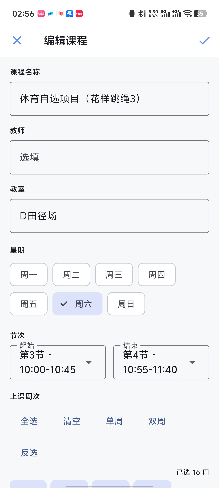
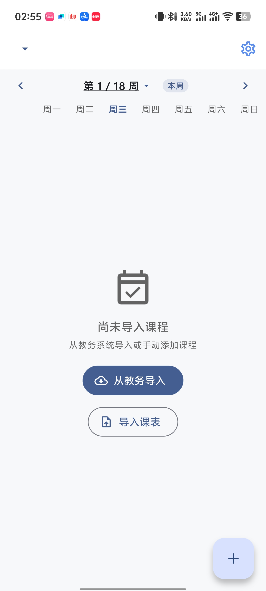
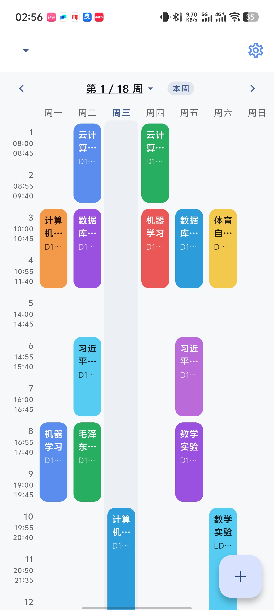

# Hormone 课表

[](https://github.com/Aetik-yue/hormone/actions/workflows/ci.yml)
[](https://github.com/Aetik-yue/hormone/releases)
[](LICENSE)
[](https://flutter.dev)

一款简洁、轻量的 Android 大学课程表 App（Android 7.0+）。

## 截图

| 周视图 | 课程编辑 | 学期管理 | 设置 | 教务导入 |
|--------|----------|----------|------|----------|
|  |  |  |  |  |

## 功能

### 课表视图
- **周视图网格**：7 天 × 16 节次，彩色课程卡片按节次定位，超出屏幕可纵向滚动
- **周次导航**：左右滑动 / 点击箭头切换周次，支持快速跳转到任意周
- **今日视图**：一键查看今日课程时间线，标注进行中 / 未开始 / 已结束
- **课程搜索**：按名称 / 教师 / 教室快速检索，结果可直接跳转到该课程所在周
- **当前周定位**：根据开学日期自动计算当前周，支持手动覆盖（调课/假期）
- **今日高亮**：今天列背景微高亮，星期表头加粗

### 课程管理
- **添加/编辑/删除**：支持课程名、教师、教室、星期、节次、周次、颜色、备注
- **周次选择**：全选/清空、单周/双周、反选，支持最多 40 周
- **课程复制**：一键复制课程，快速创建相似课程
- **未保存提醒**：编辑后退出时提示放弃修改

### 学期管理
- **多学期切换**：底部选择器快速切换，激活学期置顶
- **当前周覆盖**：支持手动调整当前周（应对调课/假期）
- **级联删除**：删除学期时自动清理关联课程

### 数据导入
- **教务系统 WebView 导入**：内置浏览器登录教务系统，自动抓取课表
  - 专用适配：重庆大学（金智 XCampus）、江西财经大学（青果）、沈阳化工大学（正方）、南昌大学（强智）、井冈山大学（金智智慧校园）
  - 高校目录：共 43 所学校，按校名拼音排列；支持按学校名、拼音、系统名或 URL 搜索
  - 系统兼容：没有专用适配器的学校按公开可确认的教务产品类型复用对应规则
  - 通用入口：任意教务系统 URL，通用 DOM 抓取器兜底
- **文件导入**：支持 ICS 日历文件和 JSON 模板批量导入
- **导入模式**：整体替换 / 合并追加两种模式，合并时与现有课表冲突的课程标红提示
- **执行确认**：导入前二次确认，明确影响面
- **智能解析**：自动识别课程编号、周次、节次、教室等信息

### 个性化
- **课前提醒**：开启后每节课开始前 5/10/15/30 分钟推送通知，随课表变化自动重排
- **节次时间自定义**：逐节修改开始时间和时长，支持预设模板（45分钟/90分钟/50分钟制），最多 16 节
- **主题切换**：浅色 / 深色 / 跟随系统，重启后保留
- **课程卡片颜色**：10 色预设配色
- **无障碍**：课表节高随系统字号缩放，课程卡片带可读语义标签

### 数据管理
- **导出备份**：一键导出全部学期和课程为 JSON，通过系统分享面板保存
- **从备份恢复**：全量恢复多个学期与课程，激活学期与周次覆盖一并还原
- **桌面小组件**：通过 Android App Widget 显示今日课程，数据变化自动刷新，跨午夜同步更新
- **应用内更新**：每天自动检查 GitHub Release，也可在设置中手动检查；支持更新说明、下载进度与 SHA-256 完整性校验

## 技术栈

| 类别 | 技术 |
|------|------|
| 框架 | Flutter 3.29+ / Dart 3.7+ |
| 状态管理 | flutter_riverpod（Provider / StateNotifier / StreamProvider） |
| 数据库 | drift（SQLite），后台 isolate 打开 |
| 路由 | go_router |
| WebView | webview_flutter（教务系统登录抓取） |
| 本地通知 | flutter_local_notifications（课前提醒） |
| 桌面小组件 | home_widget |
| 应用内更新 | GitHub Releases + ota_update |
| 分享 | share_plus（导出备份转存） |
| CI/CD | GitHub Actions |

## 项目结构

```
lib/
├── app/              # GoRouter 路由定义
├── core/             # 常量、领域模型、主题、工具函数
│   ├── constants/    # 应用级常量（节次时间表、课程配色等）
│   ├── models/       # 领域模型（Course、Semester）
│   ├── theme/        # Material 3 主题配色
│   └── utils/        # 纯函数工具（周次计算等）
├── data/             # 数据层
│   ├── repositories/ # 数据访问（Course / Semester / Backup Repository）
│   ├── mappers/      # drift 实体 ↔ 领域模型映射
│   ├── tables/       # Drift 表定义
│   └── providers/    # Riverpod Provider
└── features/         # 功能模块（feature-first：application/ + presentation/ + 可选 domain//data/）
    ├── course/       # 课程增删改
    ├── import/       # 文件导入 + 教务系统 WebView 导入（学校适配器在 data/）
    ├── notification/ # 课前提醒（设置、调度纯函数、通知服务）
    ├── schedule/     # 周视图主界面（今日视图、课程搜索、详情弹层）
    ├── semester/     # 学期管理
    ├── settings/     # 设置（主题/节次时间/提醒/备份恢复）
    ├── update/       # 应用内更新（版本检查、APK 下载与系统安装）
    └── widget/       # 桌面小组件数据桥接
```

根部的 `_AppEffects`（`lib/main.dart`）集中触发副作用：任一课表/节次/提醒设置变化 → 防抖刷新桌面小组件并重排课前提醒；回到前台与跨午夜时补跑。

## 开发环境

### 前置要求

- Flutter SDK >= 3.29.0（Dart >= 3.7.0）
- Android Studio（包含 Android SDK 与 JDK）
- Node.js（仅部分适配器测试需要：用 Node 执行提取脚本做单测）

### 快速开始

```bash
# 克隆项目
git clone https://github.com/Aetik-yue/hormone.git
cd hormone

# 安装依赖
flutter pub get

# 生成 Android 平台目录（android/ 已排除出版本控制）
flutter create . --platforms=android --org com.aetikyue

# 运行
flutter run
```

> 注意：`android/` 重新生成后需按 `WIDGET_SETUP.md` 恢复桌面小组件模板，
> 并确认 app 级 Gradle 启用 core library desugaring（`flutter_local_notifications`
> 依赖），CI 中这些步骤由 `.github/workflows/release.yml` 自动完成。

### 代码生成

项目使用 drift 和 go_router，修改数据库表或路由后需要重新生成代码：

```bash
dart run build_runner build --delete-conflicting-outputs
```

### 启动图标与启动页

```bash
dart run flutter_launcher_icons
dart run flutter_native_splash:create
```

### 运行测试

```bash
flutter test
```

### 代码分析

```bash
flutter analyze --fatal-infos --fatal-warnings
```

## 构建发布

### Android APK

```bash
flutter build apk --release
```

APK 输出至 `build/app/outputs/flutter-apk/app-release.apk`。

### Android App Bundle

```bash
flutter build appbundle --release
```

### CI 自动构建

推送 `v*` tag（如 `v1.2.3`）会触发 [Release Build](.github/workflows/release.yml)，
在干净环境重建 `android/`、注入原生模板与稳定签名配置，构建 APK/AAB、生成
SHA-256 校验文件，并自动发布为 GitHub Release；App 的更新检查会读取这里的最新正式版本。
首次配置签名密钥与 GitHub Actions Secrets 的步骤见 [Android 发布指南](docs/RELEASE.md)。

## 适配新学校

在 `lib/features/import/data/` 下新建适配器：

```dart
class MySchoolAdapter extends SchoolAdapter {
  @override String get schoolName => '学校名';
  @override String get loginUrl => '教务系统登录页 URL';
  @override String get scheduleUrl => '课表页 URL';
  @override bool isSchedulePage(String url) => ...;
  @override String get extractJs => '提取课程的 JavaScript';
}
```

然后在 `school_adapter.dart` 的 `schoolAdapters` 注册列表和
`_schoolPinyinKeys` 拼音键映射中添加学校即可。

### 适配器开发要点

- `extractJs` 返回的 JSON 需符合 `ExtractedCourse.fromJson` 的要求：
  `name` / `dayOfWeek`(1-7) / `startSection` / `endSection` / `weeks`（1-based），
  `teacher` / `location` 可选
- 保证 `startSection <= endSection`：节次文本解析后请排序去重，
  否则 release 构建（assert 关闭）下会导致课表布局崩溃
- 需要跳转/等待时返回 `{"__nav": true}`（已跳转）或 `{"__pending": true}`
  （课表加载中），App 侧会延迟自动重试（上限 3 次）
- 提取脚本按 IIFE 编写，可参考 `ncu_adapter.dart`（接口直调 + DOM 兜底 +
  导航重试的三段式结构）；`generic_adapter.dart` 提供可复用的通用 DOM 抽取器
- 建议为提取脚本编写 Node 单测（mock `document`/`XMLHttpRequest`），
  参见 `test/jgsu_adapter_test.dart`

## 贡献指南

欢迎提交 Issue 和 Pull Request！

1. Fork 本仓库
2. 创建特性分支 (`git checkout -b feature/xxx`)
3. 提交更改 (`git commit -m 'feat: xxx'`)
4. 推送分支 (`git push origin feature/xxx`)
5. 提交 Pull Request

### 代码规范

- 遵循 [Effective Dart](https://dart.dev/guides/language/effective-dart) 风格
- 提交前运行 `flutter analyze --fatal-infos --fatal-warnings` 确保无错误
- 提交前运行 `flutter test` 确保测试通过
- 新功能需包含单元测试

## License

[MIT](LICENSE)

## 致谢

- 课表配色参考 [WakeUp 课表](https://wakeup.cool/)
- 感谢所有贡献者和测试用户
