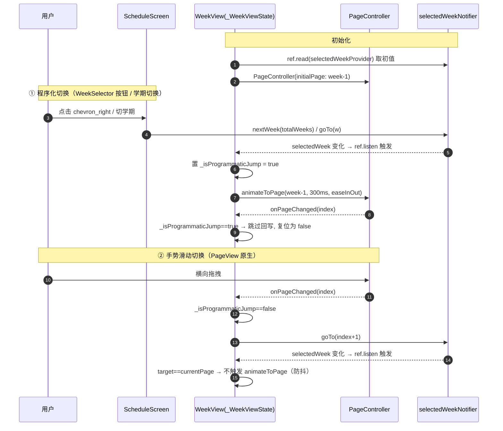
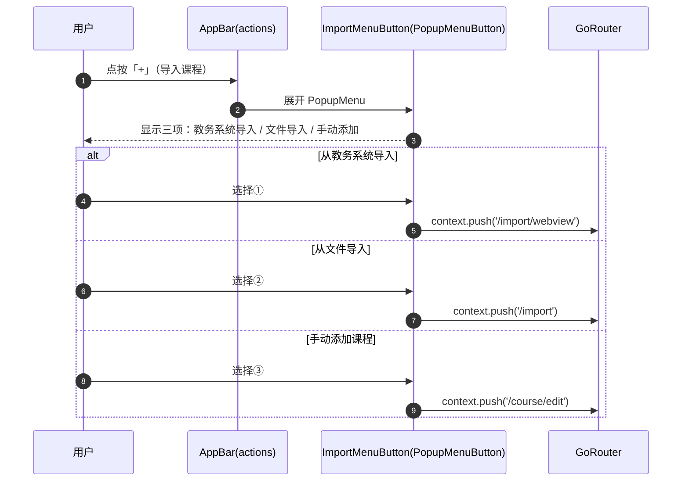
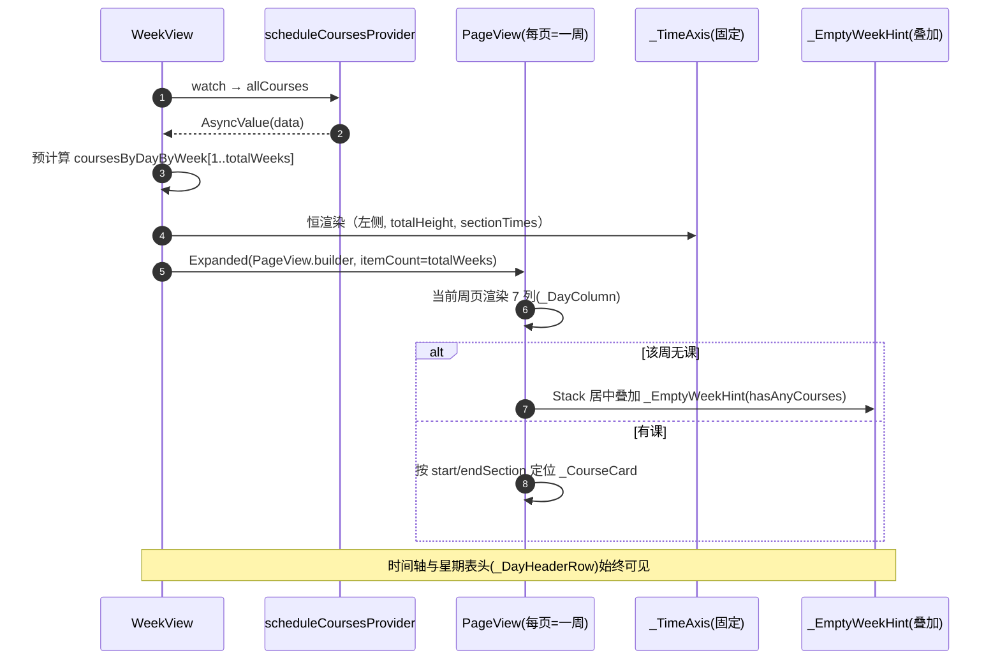
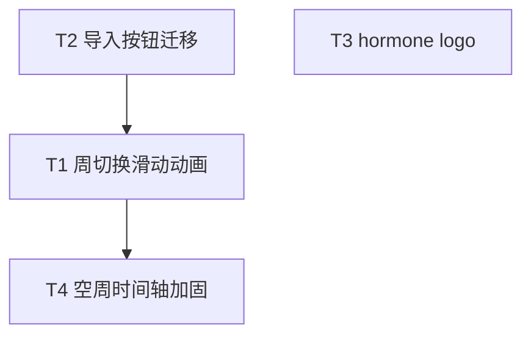

# hormone 增量设计与任务分解（4 项任务）

> 架构师：高见远（software-architect）｜面向工程师的交付物
> 范围：周切换滑动过渡动画、导入按钮迁移、hormone 主题 logo、空周时间轴消失修复
> 技术栈（已核实）：Flutter + Riverpod + go_router + drift（状态/路由/持久化均不变）

---

## A. 实现方案总述与框架/方案选型理由

### A.1 总体原则
四项任务均为**增量改动**，**不破坏既有 Provider / 路由 / 数据模型**：
- `selectedWeekProvider`（1-based `int`）及其 `goTo / nextWeek / prevWeek` 接口保持不变，仍是周次的唯一真相源（Single Source of Truth）。
- `router.dart` 的四条路由（`/import`、`/import/webview`、`/course/edit`、`/settings`）保持不变，仅由新菜单 `push`，不新增/不改动路由。
- `settings_screen.dart` 完全不动（任务 2 明确要求保留其「数据」区导入选项）。
- `Course` 模型、`scheduleCoursesProvider`、`sectionTimesProvider`、`activeSemesterProvider` 均不变；`WeekView` 的 `totalWeeks` 由 `ScheduleScreen` 以**构造参数**传入，避免新增 provider 监听。

### A.2 任务 1 选型：PageView vs AnimatedSwitcher（结论：PageView.builder）

| 维度 | PageView.builder | AnimatedSwitcher |
|------|------------------|------------------|
| 横滑手势 | 原生支持（拖拽即翻页 + 物理惯性） | 需自行包装 `GestureDetector`/`PageView` 才能滑动 |
| 周次切换动画 | `animateToPage` 自带横向位移，语义即「翻周」 | 需手动定义过渡（slide/fade），无原生位移 |
| 时间轴固定 | 时间轴置于 `PageView` 之外（`Row:[_TimeAxis, Expanded(PageView)]`），天然不随页面滑动 | 需把时间轴抽离出切换子树，较别扭 |
| 与现有结构契合 | 仅替换「`Expanded(Row(7 列))`」为「`Expanded(PageView(7 列/页))`」，改动局部 | 需包裹整个 `Row`，重构面更大 |
| 性能 | `builder` 懒构建，仅渲染可见页 + 相邻页 | 同时持有 old/new 两棵子树，空周场景浪费小但语义弱 |

**结论**：选用 **`PageView.builder`** 承载 7 天列网格，由 `selectedWeekProvider` 驱动；`PageController` 初始页 = `selectedWeek-1`；当 notifier 改变周次（手势 / WeekSelector 按钮 / 学期切换）时 `controller.animateToPage(week-1)`；`onPageChanged` 时回写 notifier，并**用 `isProgrammaticJump` 标志位防死循环**（详见 D.1）。时间轴 `_TimeAxis` 独立于 PageView 固定在左侧。

### A.3 任务 2 选型：PopupMenuButton
复用 Flutter material 自带 `PopupMenuButton<ImportTarget>`（无需新依赖），`icon: Icons.add`，三项菜单分别 `context.push` 既有路由。放置于 `AppBar.actions` 中 `settings` 按钮**之前**，`tooltip`/`semanticLabel` 写「导入课程」，保证无障碍可达。

### A.4 任务 3 选型：Python 标准库 + SVG 概念稿
保留现有 `tools/generate_assets.py`（仅 `zlib`/`struct` 标准库）绘制范式；新增 `draw_molecule_calendar()` 在「课程表卡片」基调上叠加分子/激素语义（节点圆 + 连接键线条），主色沿用 `PRIMARY=(0x5B,0x8D,0xEF)`。另产出一个 `assets/logo_concept.svg` 供用户预览确认风格，再据此落地 Python 像素方案。

### A.5 任务 4 选型：渲染契约（被任务 1 天然覆盖 + 加固）
根因（已核实 `week_view.dart:47-49`）：`weekCourses.isEmpty` 时直接 `return _EmptyWeekHint`，绕过了含 `_TimeAxis` 的 `Row`，时间轴不显示。任务 1 将渲染重构为「**恒渲染 `_TimeAxis` + 每页 7 列**」，空周仅在第 1 页（或当前周页）叠加 `_EmptyWeekHint` 文案，故任务 4 的修复被任务 1 的重构**天然覆盖**。任务 4 作为依赖任务，负责在任务 1 的新结构上**加固三态契约**（loading/error/empty 均保留时间轴与星期表头）并补充空周回归测试。

---

## B. 文件清单与每文件改动点

| # | 文件（相对仓库根） | 任务 | 改动点 |
|---|-------------------|------|--------|
| 1 | `lib/features/schedule/presentation/week_view.dart` | T1, T4 | 由 `ConsumerWidget` 改为 `ConsumerStatefulWidget`；新增 `_WeekViewState` 持有 `PageController` 与 `bool _isProgrammaticJump`；`initState` 建 `PageController(initialPage: selectedWeek-1)`；`build` 内 `ref.listen(selectedWeekProvider, …)` 触发 `animateToPage`/`jumpToPage`；新增 `_WeekColumns`（按周过滤 7 列）；`Row([_TimeAxis, Expanded(PageView.builder)])`；空周叠加提示（见 T4）；`loading/error` 分支也保留时间轴外壳。 |
| 2 | `lib/features/schedule/presentation/schedule_screen.dart` | T1, T2 | T1：移除 `body` 的 `GestureDetector`（横滑交由 PageView 原生处理）；向 `WeekView(totalWeeks: totalWeeks)` 传参。**T2**：删除 `floatingActionButton`；`AppBar.actions` 新增 `ImportMenuButton`（见 #4），置于 `settings` 之前；同步更新 `_EmptyWeekHint` 文案「点右下角 +」→「点右上角 + 导入课程」。 |
| 3 | `lib/features/schedule/presentation/import_menu.dart` | T2（新增） | 新增 `ImportMenuButton` 无状态组件：`PopupMenuButton<_ImportTarget>`，三项 `PopupMenuItem`：`从教务系统导入`→`/import/webview`、`从文件导入`→`/import`、`手动添加课程`→`/course/edit`；`tooltip:'导入课程'`，`semanticLabel:'导入课程'`。 |
| 4 | `test/features/schedule/week_view_test.dart` | T1（新增） | Widget 测试：断言 `PageView` 存在；模拟 `nextWeek` 后 `PageController.page` 变化且 `selectedWeek` 一致；验证 `isProgrammaticJump` 防回写死循环（程序化切换不二次触发 `goTo`）。 |
| 5 | `test/features/schedule/schedule_screen_test.dart` | T2（新增） | 断言 AppBar 含「导入课程」按钮；点按弹出菜单三项分别 `push` 到 `/import/webview`、`/import`、`/course/edit`；`settings` 入口仍可用；FAB 已移除。 |
| 6 | `test/features/schedule/week_view_empty_test.dart` | T4（新增） | 回归测试：构造空周 `allCourses` → 断言 `_TimeAxis` 与 `_DayHeaderRow` 仍渲染、`_EmptyWeekHint` 出现且文案区分「本周暂无课程 / 尚未导入课程」。 |
| 7 | `tools/generate_assets.py` | T3 | 改写绘制逻辑：新增 `draw_molecule_calendar()`（课程表网格 + 1 个实心课块 + 3 处分子节点/连接键）；`build_icon()/build_logo()` 调用之；`PRIMARY` 常量复用；保留 `write_png`/PNG 编码。 |
| 8 | `assets/logo_concept.svg` | T3（新增） | SVG 概念稿（圆角蓝底 + 白色课表卡片 + 网格 + 分子节点连线），供预览确认风格后落地 Python。 |
| 9 | `assets/icon/icon.png`、`assets/splash/logo.png` | T3 | 由改写后的 `generate_assets.py` 重新生成（脚本产物，非手改）；如需各分辨率图标，沿用现有 `flutter_launcher_icons` pipeline。 |

**不改动**：`lib/app/router.dart`、`lib/features/settings/presentation/settings_screen.dart`、`lib/features/schedule/application/schedule_providers.dart`、`Course` 模型、`scheduleCoursesProvider`、`sectionTimesProvider`、`activeSemesterProvider`。

### B.1 任务 3 —— Python 绘制「分子+课表」像素方案（供 `generate_assets.py` 落地）

**复用常量**：`S=1024`、`PRIMARY=(0x5B,0x8D,0xEF)`、`WHITE=(255,255,255)`、`GRID=(0xD9,0xDE,0xE8)`；新增 `ACCENT=(0x9D,0xC0,0xFF)`。卡片 `m=150`，即卡片区 `(150,150)-(873,873)`，`r=96`。网格 `cols=3, rows=4` → `cw=241`、`rh=181`（取整）。

**新增两个标准库 helper**（纯 `set_px`/`fill_rect` 组合，无依赖）：
- `fill_circle(buf, cx, cy, r, color)`：遍历包围盒，按 `(x-cx)²+(y-cy)² ≤ r²` 置色。
- `draw_line(buf, x0, y0, x1, y1, color, w)`：沿长轴步进，每步 `fill_rect` 一个 `w×w` 方块近似连线。

**`draw_molecule_calendar(buf, x0, y0, x1, y1, r)` 步骤**：
1. `fill_rounded_rect` 白色卡片（同现状）。
2. 网格线：`line=10`、内缩 `14`；竖线 `x=391,632`（`y∈[164,859]`），横线 `y=331,512,693`（`x∈[164,859]`），色 `GRID`。
3. **实心课块**（保留课表语义）置于 `(col0,row0)`：`x0=162,y0=162,x1=379,y1=319`，`r=14`，色 `PRIMARY`。
4. **3 处分子 motif**（节点圆 + 白色连接键三角形），坐标（与 `assets/logo_concept.svg` 一致）：
   - Motif① 单元 `(col0,row1)`：节点 `(270,384)/(230,456)/(312,456)`，其中 `(230,456)` 用 `ACCENT`，其余 `PRIMARY`；白色键连接三点成三角（宽 6）。
   - Motif② 单元 `(col1,row2)`：节点 `(512,562)/(472,636)/(554,636)`，`(554,636)` 用 `ACCENT`；白色三角键。
   - Motif③ 单元 `(col2,row0)`：节点 `(753,202)/(713,275)/(795,275)`，`(753,202)` 用 `ACCENT`；白色三角键。
   - 节点半径 `r=20`。
5. 其余网格单元留白，维持「课程表」观感。

**`build_icon()`**：`fill_rounded_rect(0,0,S-1,S-1,224,PRIMARY)` 后调用 `draw_molecule_calendar(150,150,873,873,96)`。
**`build_logo()`**：透明底，仅 `draw_molecule_calendar(150,150,873,873,96)`。
`write_png`/`main` 逻辑不变；`icon.png` 重生成后如需各平台分辨率，沿用现有 `flutter_launcher_icons` pipeline（配置不变）。

---

## C. 数据结构 / 接口不变说明

- **Provider 接口（不变）**：`selectedWeekProvider: StateNotifierProvider<SelectedWeekNotifier,int>`；`SelectedWeekNotifier.goTo(int)` / `nextWeek(int totalWeeks)` / `prevWeek()` 签名与 1-based 语义保持不变。任务 1 仅**消费**该 provider（watch + listen + notifier.goTo），不修改其定义。
- **路由（不变）**：`router.dart` 四条相关路由路径与 builder 不变；`ImportMenuButton` 仅 `context.push`，不新增路由、不改 `extra` 约定（`/course/edit` 仍接受 `extra: courseId`）。
- **数据模型（不变）**：`Course`（`id/name/dayOfWeek/startSection/endSection/weeks/colorValue/...`）与 `sectionTimes`、`courseOnWeek()` 工具函数均不改；任务 1 的 `_WeekColumns` 仍调用 `courseOnWeek(c.weeks, week)` 过滤。
- **新增类型（局部、不污染全局）**：仅在 `import_menu.dart` 内定义私有枚举 `_ImportTarget { webview, file, manual }`，不进入公共 API。
- **组件契约（新增但向后兼容）**：`WeekView` 由无参 `const WeekView()` 变为 `WeekView({required int totalWeeks})`；调用方仅 `schedule_screen.dart` 一处，已同步更新。

---

## D. 程序调用 / 交互流程

### D.1 任务 1 — 周切换动画闭环（核心，含防死循环）

**落点说明（迁移手势）**：
- `ScheduleScreen.body` 的 `GestureDetector(onHorizontalDragEnd…)` **整体删除**；横滑改由 `WeekView` 内的 `PageView` 原生处理。
- `WeekSelector` 的 `onPrev/onNext` 仍调用 `prevWeek()/nextWeek(totalWeeks)`（不变），通过 `ref.listen → animateToPage` 完成动画（路径 ①）。
- 学期切换：在 `ScheduleScreen._showSemesterPicker` 的 `onTap` 中已调用 `selectedWeekProvider.notifier.goTo(computeCurrentWeek(...))`，会经路径 ① 自动滑到新周。
- **首屏同步**：因 `SelectedWeekNotifier._init()` 异步解析真实周次，`initState` 时 `selectedWeek` 可能仍为 1；建议首次同步用 `jumpToPage`（无动画，避免首屏滑入），后续外部变更用 `animateToPage`（见 H 待确认项）。

### D.2 任务 2 — 导入菜单交互

### D.3 任务 4 — 空周渲染路径（重构后）

---

## E. 有序任务列表（按实现顺序，含依赖）

| 任务 ID | 任务名 | 源文件 | 依赖 | 优先级 |
|---------|--------|--------|------|--------|
| **T1** | 周切换滑动过渡动画（PageView + 防死循环） | `week_view.dart`、`schedule_screen.dart`（去 GestureDetector）、`test/week_view_test.dart` | 无 | **P0** |
| **T2** | 导入按钮移至右上角设置按钮旁（PopupMenu） | `schedule_screen.dart`（去 FAB+加菜单）、`import_menu.dart`（新）、`test/schedule_screen_test.dart`（新） | 无（与 T1 同改 schedule_screen.dart，建议 T2 先于 T1 落地或紧随） | **P0** |
| **T4** | 加固空周/三态时间轴恒可见（渲染契约 + 回归） | `week_view.dart`（三态外壳）、`test/week_view_empty_test.dart`（新） | **T1**（在 T1 重构后的结构上加固） | **P1** |
| **T3** | hormone 主题 logo（SVG 概念 + Python 落地 + 重生成 PNG） | `generate_assets.py`（改写）、`assets/logo_concept.svg`（新）、`icon.png`/`logo.png`（重生成） | 无（可并行） | **P2** |

**实现顺序建议**：`T2 → T1 → T4 → T3`。`T2` 与 `T3` 互不依赖、可并行；因 `T2`、`T1` 都改 `schedule_screen.dart`，按序（先 T2 后 T1）可避免同文件反复改；`T4` 必须在 `T1` 之后（在其新结构上加固）；`T3` 随时可做的品牌/资产任务，置后。

### E.1 任务依赖图（Mermaid）

---

## F. 依赖包清单

- **Flutter 侧：无新增依赖。** `PageView`/`PageController`/`PopupMenuButton` 均属 Flutter SDK（`material`）；`flutter_animate` 已在 `pubspec.yaml` 中（`_CourseCard` 动画复用）。
- **tools 侧：无新增依赖。** `tools/generate_assets.py` 仅用 Python 标准库（`zlib`、`struct`、`os`），与现状一致。
- **资产：** `assets/logo_concept.svg` 为静态矢量预览，不参与构建依赖。

---

## G. 共享知识 / 跨文件约定

1. **`isProgrammaticJump` 标志**（任务 1 防死循环核心）：在调用 `animateToPage` 前置 `true`，在 `onPageChanged` 中若为真则跳过 `notifier.goTo` 并复位。用户真实滑动时该标志为 `false`，正常回写 `goTo(index+1)`。
2. **首屏同步策略**：`SelectedWeekNotifier._init()` 异步解析真实周次；建议首个有效同步用 `jumpToPage`（无动画），其后外部变更用 `animateToPage`（见 H）。
3. **颜色常量复用**：`PRIMARY=(0x5B,0x8D,0xEF)` 在 `generate_assets.py` 与 Flutter 主题 `colorScheme.primary` 必须保持一致；logo / 课块 / 分子节点统一用 `PRIMARY`，分子连接键用白色（`WHITE`/`GRID`），可选浅蓝 `ACCENT=(0x9D,0xC0,0xFF)` 增强层次。
4. **布局常量保持**：`_sectionHeight=56`、`_cardInset=4`、`_timeAxisWidth=48` 不变；`_TimeAxis` 高度 `totalHeight = maxSections * _sectionHeight` 在切周时不变化（PageView 每页复用同一 `totalHeight`/`sectionTimes`）。
5. **路由字符串约定**：菜单只 `push` 既有路径 `'/import'`、`'/import/webview'`、`'/course/edit'`，不重复声明；`settings` 入口与 `settings_screen.dart` 内导入项均不动。
6. **空周渲染契约**：`_DayHeaderRow`（星期表头）与 `_TimeAxis`（时间轴）**恒可见**；空周仅在第 1 页/当前周页 `Stack` 居中叠加 `_EmptyWeekHint`，且文案区分 `hasAnyCourses`（「本周暂无课程」/「尚未导入课程」）。`loading/error` 分支也保留时间轴外壳，避免回归。
7. **文案同步**：`T2` 移除 FAB 后，`_EmptyWeekHint` 中「点右下角 + 手动添加」需改为「点右上角 + 导入课程」（与菜单位置一致）。

---

## H. 待明确事项

1. **首屏动画观感**：是否在首屏对 `PageView` 用 `jumpToPage` 而非 `animateToPage`（避免一进 App 就「滑入」）？建议采用（首同步 jump，后续 animate），待工程师确认观感。
2. **大周数边界**：`totalWeeks` 可能变化（切学期）；需确认 `animateToPage` 目标越界保护（`clamp` 到 `[0, totalWeeks-1]`），以及 `PageController` 在 `itemCount` 变小后的 `page` 校正。
3. **logo 视觉风格确认**：分子图案具体形态（六边形节点 vs 圆点连线三角形）希望主理人/用户从 `assets/logo_concept.svg` 预览后确认，再据此敲定 `generate_assets.py` 像素细节。
4. **图标分辨率 pipeline**：`icon.png` 重生成后是否仍需跑 `flutter_launcher_icons` 刷新各平台 mipmap（沿用既有 pipeline，无需改配置）。
5. **`_EmptyWeekHint` 在无课分支**当前指向「设置 → 从教务系统导入」文案，与 T2 右上角菜单并存，是否需要补充「或点右上角 +」提示（建议补，见 G.7）。

---

## 附：类 / 组件关系（Mermaid classDiagram，见 `docs/class-diagram.mermaid`）

- 新增/变更类型：`WeekView`(ConsumerStatefulWidget) → `_WeekViewState{PageController _pc; bool _isProgrammaticJump}`；`_WeekColumns`(StatelessWidget, week, coursesByDay, …)；`ImportMenuButton`(StatelessWidget)。
- 复用类型（不变）：`SelectedWeekNotifier`、`ScheduleScreen`、`_DayHeaderRow`、`_TimeAxis`、`_DayColumn`、`_CourseCard`、`_EmptyWeekHint`、`PopupMenuButton`(SDK)。
- 关系：`_WeekViewState` --listen--> `selectedWeekProvider`；`WeekView` *contains* `_TimeAxis` + `PageView`(hosts `_WeekColumns`)；`_WeekColumns` *contains* 7×`_DayColumn`；`_DayColumn` *contains* `_CourseCard`；`ScheduleScreen` *uses* `ImportMenuButton`；`ImportMenuButton` --push--> 路由（不变）。
